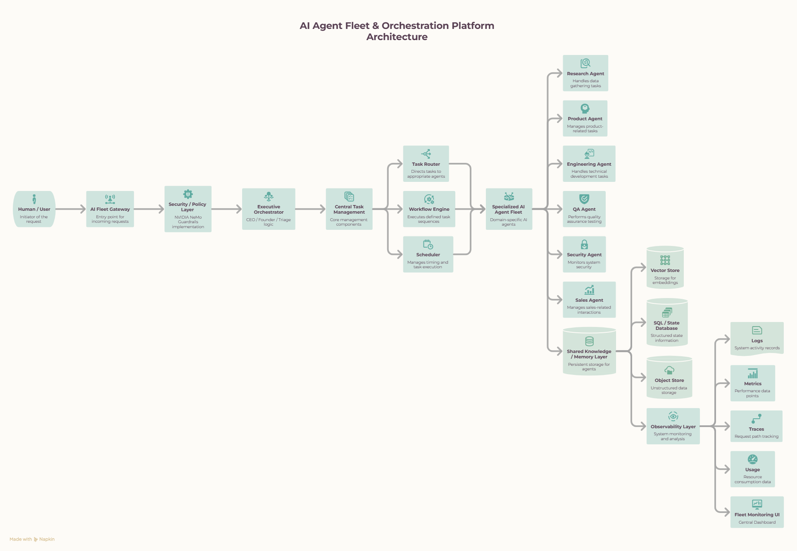

# Architecture

The architecture follows one pipeline: **Receive → Secure → Orchestrate → Route → Execute → Store → Observe**.

## 2.1 High-Level Architecture



This is the platform's **logical** architecture — it describes responsibilities and relationships, not a specific infrastructure or deployment technology. How this actually runs on OpenClaw is covered separately in `runtime.md`; don't treat this diagram as an implementation spec.

## 2.2 Architectural Components

### 1. Fleet Gateway

The entry point into the fleet. Receives requests from users or external applications and passes them in.

```
User
 ↓
Fleet Gateway
```

It's the boundary between external requests and the internal fleet — nothing reaches an agent without going through it first.

### 2. Authentication / Policy / Security

Before a request reaches any agent, the platform resolves: who's making the request, what they're allowed to do, what data they can access, what operations are permitted. This layer establishes the platform's security and authorization boundaries.

Full detail in `security-architecture.md` — this section is the entry point into that layer, not the whole model.

### 3. NeMo Guardrails

NVIDIA NeMo Guardrails is an additional policy and safety layer around model interactions, retrieval, and tool execution. It is **not** the complete security architecture — authentication, authorization, permissions, tool controls, and secret management all still have to exist independently of it.

```
Application Security
       +
NeMo Guardrails
       ↓
Controlled Agent Execution
```

### 4. Executive Orchestrator

The manager of the fleet. It:

- Understands the request.
- Determines what needs to be done.
- Decomposes complex tasks.
- Coordinates specialized agents.
- Tracks execution.
- Collects results.
- Determines whether more work is required.
- Produces the final result.

It does not perform every task itself — that's the whole point of having specialized agents underneath it. How the Orchestrator is actually implemented on OpenClaw (session handling, how it dispatches to other agents) is covered in `runtime.md`, not here.

### 5. Task Router

Determines which department and agent should execute a task.

```
MARKET_RESEARCH
     ↓
Research Department
     ↓
Market Research Agent
```

The important principle: routing is **deterministic and policy-controlled**, not something every agent is free to opt into. An agent doesn't get to decide it wants a piece of work — the router decides.

### 6. Specialized Agents

Perform the actual domain-specific work: Research, Product, Engineering, QA, Security, Sales, DevOps, and so on. Each has bounded responsibilities, tools, permissions, memory policies, and execution context.

> This is the fleet's full eventual roster. See `runtime-agents.md` for which of these are actually in scope at the current build phase.

### 7. Tool Gateway

Agents don't get unrestricted, direct access to infrastructure.

```
Agent
 ↓
Tool Gateway
 ↓
Git / Cloud / APIs / Database / Browser
```

The Tool Gateway is where authentication, authorization, tool permissions, validation, rate limits, logging, approval requirements, secret injection, and audit trails actually get enforced — in code, at this layer, not asserted anywhere else. Full detail in `security-architecture.md`.

### 8. Shared Knowledge

Agents retrieve relevant organizational knowledge from a common knowledge layer.

**The distinction that matters:** shared knowledge does not mean shared execution context. An agent accessing authorized knowledge never inherits another agent's private task state along with it.

### 9. Persistence Layer

Different kinds of information live in different systems, on purpose:

| Store | Holds |
|---|---|
| Memory / Vector DB | Organizational knowledge, semantic memory |
| Relational Database | Tasks, agents, sessions, permissions, workflows, usage |
| Object Storage | Reports, files, artifacts, large outputs |

This separation keeps operational state and long-term knowledge distinct rather than blurred together in one store.

### 10. Observability

Everything meaningful happening inside the fleet should be observable, across three forms:

- **Logs** — what happened.
- **Metrics** — how the system is performing.
- **Traces** — how a request traveled through the system.

This is what lets operators understand execution, identify failures, measure performance, and track resource usage — not an afterthought bolted on once something breaks.

### 11. Fleet UI

The centralized operational view of the system. Can expose: agent health, running tasks, queued tasks, workflows, sessions, logs, traces, memory, token usage, costs, errors, security events, human approvals.

The Fleet UI is not a chat interface — it's the operational control and monitoring surface for the whole fleet.